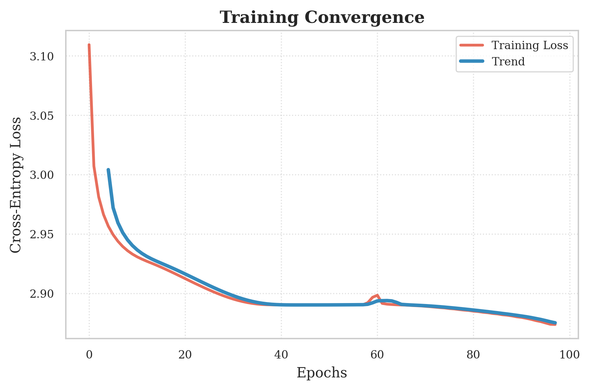
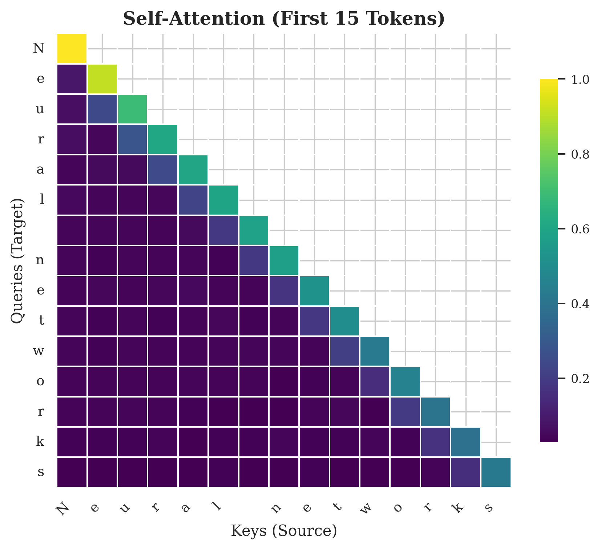
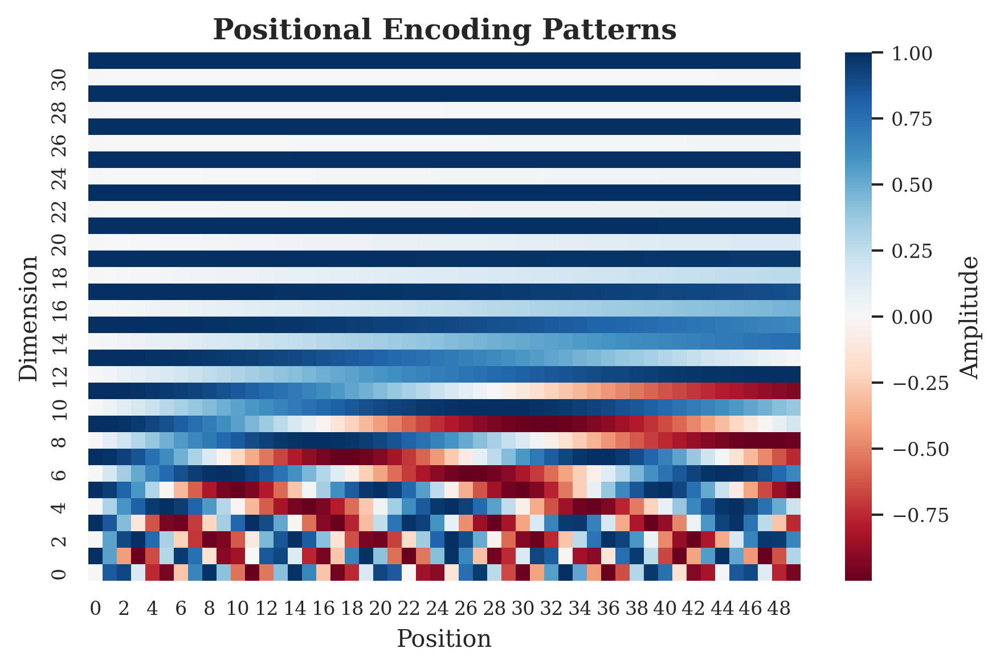

# **MicroGPT-from-Scratch: Реализация decoder-only архитектуры с поддержкой автоматического дифференцирования на чистом Python**


## **About**

Данный проект представляет реализацию decoder-only (GPT) с нуля, без использования специализированных библиотек глубокого обучения (PyTorch, TensorFlow и другие). Мотивацией было полностью разобраться в работе всех современных LLM-пайпланов, в частности разобраться в работе механизма внимания, являющимся сердцем каждой языковой модели. Исследование охватывает весь цикл обработки данных: от обучения токенизатора, до процесса стохастической оптимизации.


## **Hierarchy**

```
Project/
├── engine.py               # Autograd          
├── layers.py               # Основные слои                      
├── model.py                # Decoder-блок и основной класс GPT        
├── optimizer.py            # SGD-оптимизатор    
├── tokenizer.py            # BPE-токенизатор
├── utils.py                # Векторные и матричные операции
├── training.ipynb          # Ноутбук с обучением
```

## **1. Autograd**

Система автоматического дифференцирования в обратном режиме (Autograd) в основе которой лежит динамический вычислительный граф является отличительной особенностью данного исследования.

Каждое математическое выражение мы представляем в виде направленного ациклического графа (Directed Acyclic Graph, DAG)

Каждый скаляр оборачивается в класс Value, представляющий узел графа. Собственно в каждом узле хранится:
* результат прямого прохода
* скалярное значение градиента
* ссылки на дочерние узлы
* функцию локальной производной

Во время прямого прохода при выполнение любой математической операции вычисляется новое скалярное значение, а так же создается новый объект Value. Таким образом строится полный граф вычислений.

Метод обратного распространения ошибки включает в себя алгоритм топологической сортировки графа (Topological Sort) на основе поиска в глубину (Depth-Fisrt Search, DFS) для обеспечения правильного порядка вычисления градиентов, а также многомерное цепное правило (Multivariate Chain Rule) для самого вычисления градиентов.

## **2. Tokenization**

Для представления текста в последовательность дискретных индексов используется алгоритм токенизация на уровне подслов (Subword Tokenization), основанный на методе (Byte-pair Encoding), который позволяет решить проблему неизвестных слов и оптимизировать длинну текста.

Исходный корпус $S = (c_1, c_2, \dots, c_N)$. Начальный словарь $V$ инициализируется множеством всех уникальных символов:

$$
V_0 = \{c \mid c \in S\}
$$

Далее на каждой итерации $t$ алгоритм вычисляет частоту $f(s_i, s_{i+1})$ всех смежных биграмм в текущей последовательности $S_{t-1}$. Целевая функция шага — поиск пары с максимальной частотой совместного появления:

$$
(s_a, s_b)^* = \arg\max_{s_i, s_j \in S_{t-1}} f(s_i, s_j)
$$

Найденная оптимальная пара объединяется в новый токен $s_{new} = s_a \oplus s_b$ и словарь расширяется: 

$$V_t = V_{t-1} \cup \{s_{new}\}
$$

Все вхождения последовательности $(s_a, s_b)$ в корпусе $S_{t-1}$ заменяются на единый токен $s_{new}$, формируя укороченную последовательность $S_t$. Итеративный процесс продолжается до тех пор, пока размер словаря $|V|$ не достигнет заданного гиперпараметра $vocab\_size$.

## **3. Attention**

Механизм многоголового казуального самовнимания (Multi-Head Causal Self-Attention) - сердце любой большой языковой модели.

Для каждой головы $h \in H$ инициализируются матрицы $W_q^{(h)}$, $W_k^{(h)}$, $W_v^{(h)}$, веса которых инициализируются из равномерного распределения $\mathcal{U}(-0.1, 0.1)$.

Для каждого $i$-того токена входной вектор $x_i$ трансформируется в вектор запроса $q_i^{(h)}$:

$$
q_i^{(h)} = x_iW_q^{(h)}
$$

Одновременно вычисляются векторы ключей $K^{(h)}$ и значений $V^{(h)}$ для токенов на позициях $j \le i$:

$$
k_j^{(h)} = x_jW_k^{(h)} \in K^{(h)}, \quad v_j^{(h)} = x_jW_v^{(h)} \in V^{(h)}
$$

После вычисляются степени внимания токена $i$ к каждому токену $j$ как скалярыне произведения векторов запроса и векторов ключей с использованием масштабирования коэффициентом $\frac{1}{\sqrt{d}}$ для сохранения стабильности градиентов:

$$
w_{i,j}^{(h)} = \frac{q_i^{(h)} \cdot k_j^{(h)}}{\sqrt{d}}
$$

Далее происходит преобразование степеней внимания в вероятностые распределения  с помощью функции $softmax$, с исползованием сдвига на максимальное значение (Safe Softmax) для исключения арифметического переполнения, возникающего при экспоненцировании больших чисел:

$$
w_{ij}^{(h)} = \frac{exp(w_{i,j}^{(h)} - M_i)}{\sum_{t \le i} exp(w_{ij}^{(h)} - M_i)}, \quad M_i = max_{t \le i}(w_{ij}^{(h)})
$$

В итоге для головы $h$ формируется контекстный вектор $a_{i}^{(h)}$ как взвешенная сумма векторов значений:

$$
a_{i}^{(h)} = \sum_{j \le i} w_{i,j}^{(h)}v_j^{(h)}
$$

В отличие от классической архитектуры трансформера (Transformer), где результаты голов конкатенируются и умножаются на проекционную матрицу $W_o$ представлен альтернативный метод представления итогового вектора $A_i$ как поэлементной суммы контектных векторов всех независимых голов внимания, что позволяет сохранять изначальную размерность:

$$
A_i = \sum_{i} a_i^{(h)}
$$

## **4. Other layers**

### **4.1. Positional Encoding**

Для передачи информации о порядке следования токенов используется класс позиционного кодирования (Positional Encoding).

Инициализируется матрица позиционных сигналов $PE \in \mathbb{R}^{max\_len \times d}$.

Затем для каждой позиции $pos \in [0, max\_len-1]$ и измерения $i \in [0, d-1]$ вычисляется значение, с использованием тригономертрических функций с геометрической прогрессией длин волн:

$$
PE(pos, i) =
\begin{cases}
\sin\!\left(\frac{pos}{10000^{i/d}}\right), & i \text{ — чётное} \\
\cos\!\left(\frac{pos}{10000^{(i-1)/d}}\right), & i \text{ — нечётное}
\end{cases}
$$

В конечном итоге позиционные вектора поэлементно прибавляются к векторам эмбеддингов:

$$
x_i = x_i + PE_{pos=t}
$$

### **4.2. Embedding**

Для обоработки дискретных значений токенов и проецирования их в непрерывное векторное пространство высокой размерности используется класс Эмбеддинга (Embedding)

Инициализируется обучаемая матрица $W \in \mathbb{R}^{V \times d}$, где $V$ является размерностью словаря, а $d$ - размерностью векторного пространства,  веса которой инициализируются из равномерного распределения $\mathcal{U}(-0.1, 0.1)$.

Для каждого токена $x_i$ входной последовательности извлекается соответствующая $i$-тая строка матрицы:

$$
x = OneHot(x_i) \cdot W = W_{x_i}
$$

### **4.3. Normalization**

Слой нормализации (Layer Normalization) применяется для ускорения сходимости сети и решения проблемы внутреннего ковариационного сдвига (Internal Covariate Shift).

Для каждого $i$-того токена входной последовательности вычисляется эмпирическое среднее $\mu_i$ и стандартное отклонение $\sigma_i$:

$$
\mu_i = \frac{1}{d} \sum_{j=1}^{d} x_{i,j}
$$

$$
\sigma_i = \sqrt{ \frac{1}{d} \sum_{j=1}^{d} (x_{i,j} - \mu_i)^2  } \quad , 1 \le i \le seq\_len
 $$

После центрирования и масштабирования к вектору применяется аффинное преобразование, с использованием обучаемых параметров - вектора масштабирования $\gamma \in \mathbb{R}^d$ и вектора смещения $\beta \in \mathbb{R}^d$:

$$x_{i,j} = \frac{x_{i,j} - \mu_i}{\sigma_i + \epsilon} \cdot \gamma_j + \beta_j$$

### **4.4. Feed-Forward Network**

Для позиционно-независимой обработки каждого токена по отдельности отвечает полносвязный слой (Feed-Forward Network), представляющий из себя двухслойный персептрон (MLP), независимо применяемый к каждому вектору токена $x$.

Преобразование состоит из двух линейных проекций, разделенных функцией активации ReLU (Rectified Linear Unit), с использованием обучаемых параметров для первого слоя $W_1 \in \mathbb{R}^{d \times d_{ff}}$ и $b_1 \in \mathbb{R}^{d_{ff}}$ и обучаемых параметров для второго слоя $W_2 \in \mathbb{R}^{d_{ff} \times d}$ и $b_2 \in \mathbb{R}^{d}$:

$$
FFN(x) = max(0, xW_1 + b_1)W_2 + b_2
$$

### **4.5. Dropout**

Для предотвращения переобучения (overfitting) и коадаптации признаков используется механизм структурированного дропаута на уровне токенов (Token-level Dropout).

Инициализируется параметр $p$, обозначающий вероятность зануления.
Для каждого $i$-того токена входной последовательности генерируется скалярная случайная величина:

$$
m_i \sim \text{Bernoulli}(1 - p)
$$

В конечном итоге каждый токен скалярно умножается на соответствующую скалярную случайную величину:

$$
x_i = x_i \cdot m_i
$$


## **5. Training**

Обновление параметров модели $\theta$ осуществляется с помощью алгоритма стохастического градиентного спуска (SGD).

Градиентный спуск итеративно минимизирует функцию потерь $\mathcal{L}$, сдвигая параметры в направления вектора антиградиента.

Для каждого параметра $\theta_i$ вычитается произведение значения накопленного градиента параметра на параметр скорости обучения (Learning Rate) $\eta$:

$$
\theta_{i}^{(t+1)} = \theta_{i}^{(t)} - \eta \cdot \frac{\partial \mathcal{L}}{\partial \theta_{i}^{(t)}}
$$

## **Results**

Модель была обучено на крошечном корпусе - всего 4 предложения, чисто для демонстрации валидной работы всего пайплайна.

| **Динамика обучения** | **Карта весов внимания** |
|:---:|:---:|
|  |  |
| *Сходимость функции потерь (Cross-Entropy) за 100 эпох. Плавная кривая демонстрирует стабильный градиентный спуск без признаков переобучения.* | *Визуализация весов внимания для первых токенов. Диагональная структура подтверждает, что модель научилась фокусироваться на релевантном контексте.* |

Для учета порядка слов в последовательности модель использует синусоидальные позиционные эмбеддинги. Тепловая карта ниже визуализирует уникальный сигнал, добавляемый к каждому токену:

<div align="center">
  
  <br>
  <em>Высокочастотные паттерны для локального контекста vs низкочастотные для глобального.</em>
</div>

## **References**

1. **Vaswani, A., Shazeer, N., Parmar, N., Uszkoreit, J., Jones, L., Gomez, A. N., Kaiser, Ł., & Polosukhin, I. (2017).**  
   *Attention Is All You Need.* Advances in Neural Information Processing Systems (NeurIPS).  
   [[arXiv:1706.03762]](https://arxiv.org/abs/1706.03762)

2. **Karpathy, A. (2020).**  
   *micrograd: A tiny scalar-valued autograd engine and a neural net on top of it.*  
   GitHub Repository.  
   [[Source Code]](https://github.com/karpathy/micrograd)
